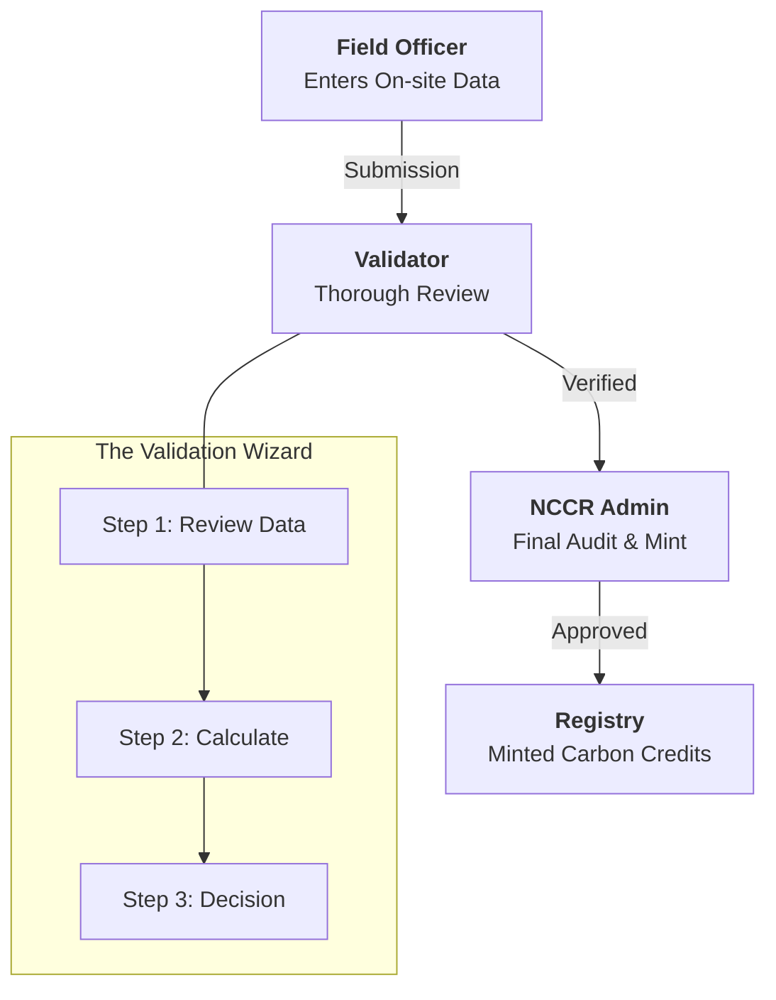

# 🌿 Blue Carbon MRV Registry

### Making carbon sequestration transparent, verified, and tokenized.

The Blue Carbon MRV (Monitoring, Reporting, and Verification) Registry is a blockchain-powered ecosystem designed to bring absolute trust to blue carbon projects. Instead of "black box" calculations, we provide a transparent journey from the field to the ledger.

---

## 🌊 The Workflow
This project bridges the gap between physical environmental efforts and digital carbon credits through a strict, three-stage verification pipeline.



---

## ✨ Key Ecosystem Modules

### 🧙‍♂️ Sequential Review Wizard
We don't believe in "bulk approval." Our UI forces a **Step-by-Step Review** to ensure no data point is missed:
1.  **Data Deep-Dive**: Inspectors review GPS coordinates, site photos, and field notes.
2.  **Interactive Calculation**: Validators perform sequestration math using the latest ecosystem constants.
3.  **Final Decision**: A formal approval or rejection with a clear audit trail.

### ⚙️ Dynamic Formula Engine
Admins have a steering wheel for the registry's math. Through the **Formula Settings** dashboard, they can update global constants (like CO₂ sequestration per tree) based on the latest IPCC Tier 1 research. These changes propagate instantly to every validator's calculation tool.

### 👥 Role-Based Trust
- **Field Officer**: The boots on the ground. Submits raw environmental data.
- **Validator**: The technical expert. Verifies data and performs calculations.
- **NCCR Admin**: The system steward. Manages formulas, users, and mints credits.
- **Public Viewer**: NGOs and the community can view the transparent registry.

---

## 🚀 Getting Started

### Prerequisites
- Node.js (v18+)
- npm

### Installation
1.  **Clone & Install**
    ```bash
    git clone [repository-url]
    cd Blue-carbon-mrv
    npm install
    ```

2.  **Launch the Dashboard**
    ```bash
    npm run dev
    ```
    The application will be available at `http://localhost:5173`.

---

## 🛠 Tech Stack
-   **Frontend**: React + Vite
-   **Styling**: Vanilla CSS (Tailored for a premium, clean layout)
-   **State Management**: React Context (Shared Calculation & Auth states)
-   **Icons**: SVG-based system for a lightweight, crisp UI

---
*Built for the future of our oceans.* 🌊🐢
